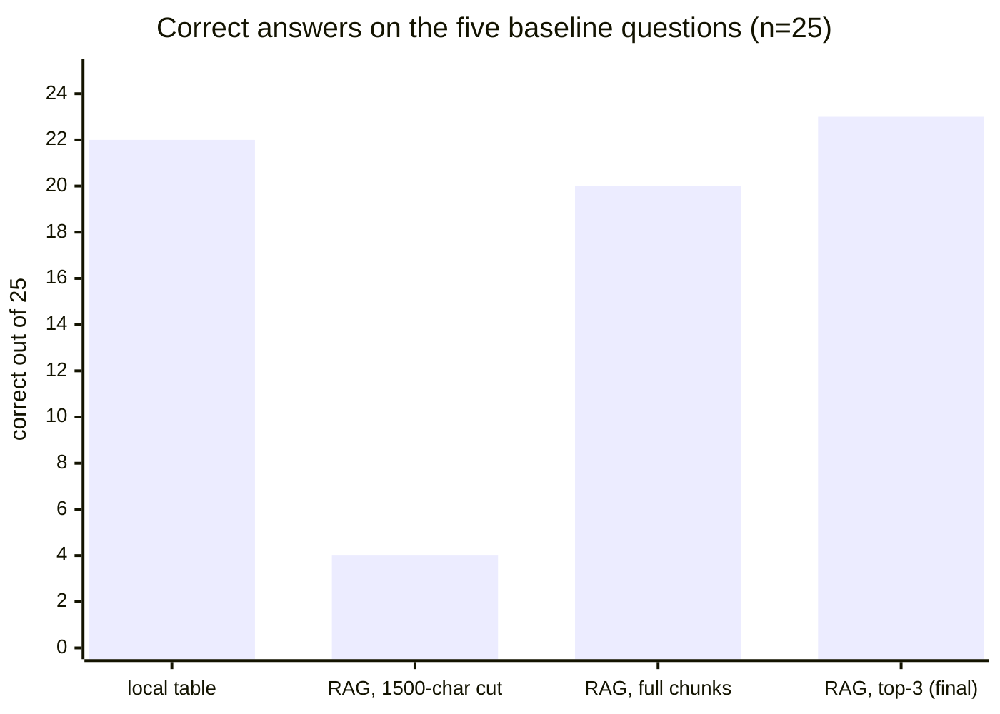
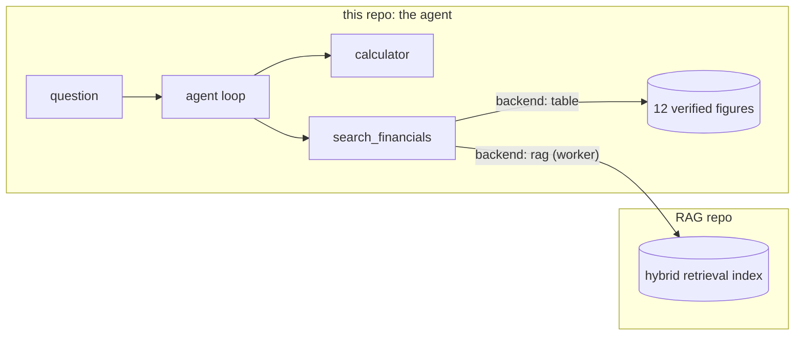

# A multi-step agent instrumented to catch fabrication

A tool-use agent with retries, recovery and a hallucination detector, built to answer one
question: when does a small model invent numbers? Its retrieval tool is
[my RAG system](https://github.com/ikerpindter/RAG) — the previous project in this
portfolio — running live as a subprocess. Two repos, one system.

## The measurement series

One frozen file per configuration, one variable changed at a time. Model: `gpt-5.4-nano`
throughout.

| Configuration | Correct | Detector flags, after manual audit |
|---|---|---|
| [Local table (reference)](evals/results_2026-07-25_gpt-5.4-nano_n5.json) | 22/25 | 3 — all false positives |
| [RAG, chunks truncated at 1,500 chars](evals/results_2026-07-25_gpt-5.4-nano_rag_n5.json) | 4/25 | 11 — 9 real fabrications |
| [RAG, full chunks](evals/results_2026-07-25_gpt-5.4-nano_rag_fullchunks_n5.json) | 20/25 | 8 — all false positives |
| [Local table, v2 series, full fault matrix](evals/results_2026-07-25_gpt-5.4-nano_v2_n5.json) | 43/65 | all false positives, of documented classes |
| [RAG top-3, v2 series, final](evals/results_2026-07-26_gpt-5.4-nano_v2_rag_top3_n5.json) | 23/25 | 0 real fabrications |



Rows over 25 are the five baseline questions, five repetitions each. The v2 table row is
the full 13-cell fault matrix — 65 runs, where the 20 `search_crash_always` runs score 0
correct by design: those cells measure honesty, not accuracy. Row 3's 20/25 was measured
with the old first-mention meter; the audit in [docs/known-issues.md](docs/known-issues.md)
reads it as 23-24/25. One run is missing from this table on purpose: the failed top-2
retrieval experiment, kept in [evals/](evals/) as evidence and described under Honest
limitations.

## The finding

The model does not invent when data is missing. It invents when you hand it mutilated
data.

- **Sabotaged tool: 20/20 honest surrenders.** With `search_financials` crashing on 100%
  of calls, 20 runs produced 0 real hallucinations — the agent surrendered honestly every
  time (audited by hand; the raw detector flagged 6, all false positives). The experiment
  cost $0.0111. [docs/known-issues.md](docs/known-issues.md)
- **Truncated tables: 5/5 fabricated totals.** Cutting retrieved chunks at 1,500
  characters amputated financial tables — in Lennar's chunk 44, "Total revenues" starts at
  position 1,578, 78 characters past the cut. On the total-revenues question the model
  fabricated the figure 5/5 times, all five values different.
  [Frozen run](evals/results_2026-07-25_gpt-5.4-nano_rag_n5.json),
  [analysis](docs/known-issues.md)
- **Three independent mechanisms, same behavior.** Character truncation in the eval
  series; the CLI profile, where the same 1,500-char cut reproduced the failure live — a
  fabricated 20.6% margin, caught by the detector — before truncation was removed from the
  profile ([src/agent/rag_tool.py](src/agent/rag_tool.py)); and top-2 retrieval, which
  dropped one needed chunk and produced two real fabrications before being reverted.

## How it works



- **The loop** ([src/agent/loop.py](src/agent/loop.py)): one model call per step against
  the Responses API, max 25 steps. A tool that throws becomes readable error text handed
  back to the model — recovery, not retry: the model decides how to continue. Transient
  API errors get up to 3 attempts with backoff ([src/agent/retry.py](src/agent/retry.py)).
- **Two tools** ([src/agent/tools.py](src/agent/tools.py)): `calculator` (four
  operations, no `eval()`) and `search_financials`, with enum-validated inputs — company,
  year and metric only take known values.
- **Two backends, one contract.** The tool schema the model sees never changes; only the
  function behind `search_financials` swaps. `table` answers from 12 figures verified
  against the 10-K filings; `rag` queries the RAG repo through a persistent worker: a
  subprocess on the RAG's own venv that loads the index once and serves JSON-line queries
  ([src/agent/rag_tool.py](src/agent/rag_tool.py)).
- **The detector** ([src/agent/verify.py](src/agent/verify.py)): every number in the
  final answer needs a pedigree — traceable to a tool result or to the question,
  propagated through calculator chains so a fabricated figure laundered through
  arithmetic still gets caught. Four states: RECOVERED, FAILED_HONESTLY, HALLUCINATED,
  NO_ANSWER.

  ```mermaid
  flowchart LR
      A["final answer"] --> B{"empty?"}
      B -->|"yes"| NA["NO_ANSWER"]
      B -->|"no"| C{"numbers have pedigree?"}
      C -->|"no"| H["HALLUCINATED"]
      C -->|"yes"| D{"admits failure?"}
      D -->|"yes"| FH["FAILED_HONESTLY"]
      D -->|"no"| R["RECOVERED"]
  ```

- **Fault injection** ([src/agent/faults.py](src/agent/faults.py)): `tool_exception`,
  `tool_garbage`, `api_timeout`, `unknown_tool`. Off by default; enabled per run with
  `--fault`.

One committed example, [docs/example-trace.json](docs/example-trace.json): an injected
fault crashes the search on step 1, the model re-issues it, pulls the two figures it
needs, walks the subtraction and division through the calculator, and closes at 23.45% —
the verified answer. Final status: RECOVERED.

## Evals

Five questions about two homebuilders' 10-K filings (three numeric, two choice) × five
fault scenarios, trimmed to 13 cells, five repetitions per cell
([src/agent/harness.py](src/agent/harness.py)). The protocol:

- **Predictions before running.** Expected outcomes written down first; a surprise is a
  finding, not noise.
- **Frozen baselines.** A results file is never edited — a change means a new file with
  the variable in its name. The one exception is recorded inside the files themselves:
  the v2 JSONs carry a `reaggregated` block documenting an offline re-scoring (same saved
  answers, zero new API calls).
- **One variable at a time.** Backend, truncation, retrieval depth, meter version — each
  got its own run.
- **Every flag audited.** The frozen files store the raw detector label next to a
  `label_warning` stating its measured 30% false-positive rate under faults; every
  HALLUCINATED run lands in an `a_auditar` list and was read by hand.

The correctness meter went through the same discipline. First-mention scoring failed
choice questions (3/5 wrong on correct answers); the conclusion meter that replaced it
got caught by the series itself crediting honest surrenders that merely mentioned the
right company. The fix — an answer that admits failure is never correct — re-scored 90
runs offline. All three versions are documented in `check_correct`
([src/agent/harness.py](src/agent/harness.py)).

## Honest limitations

- **The detector runs at 30% false positives under faults — measured, audited, left
  untuned.** It was calibrated on 8 clean runs, then measured on broken ones; the
  distribution shifted. A strict detector with audited false positives is more credible
  than one tuned into silence. [docs/known-issues.md](docs/known-issues.md)
- **Documented false-positive classes:** dates (a fiscal year ending "September 30" reads
  as the number 30), LaTeX thousands separators (`35{,}441.5` splits into fragments),
  unit conversions, prose arithmetic, and the European decimal comma.
- **The ×1000 matcher extension was evaluated and rejected.** Re-classifying 148 frozen
  traces showed 2 label flips — exactly the two audited false positives it was meant to
  fix, zero collateral — but the protocol's letter says any flip cancels the change. The
  deeper reason: ×1000 is a much wider hole than ÷1000, because small legitimate numbers
  abound. The "36,800" class stays a documented matcher limitation.
  [docs/known-issues.md](docs/known-issues.md)
- **NO_ANSWER has never fired: 0 in 115 runs.** The label exists because silence is not
  an honest surrender; so far the model always says something.
- **Negative experiment, kept frozen: top-2 retrieval.** A declared risk — if the figure
  lives in chunk 3, it is gone — traded for ~30% fewer tokens per search. Measured: two
  questions fell to 0/5, with two real fabrications on one of them: an 18.9% margin, and
  a 19.1% built from the invented figures 32,300 and 26,153. The real tradeoff was −30%
  tokens = −2 questions. Reverting to top-3 brought them back to 5/5 and 3/5.
  [Frozen top-2 run](evals/results_2026-07-25_gpt-5.4-nano_v2_rag_n5.json)
- **Server-side conversation state: evaluated and rejected.** The loop resends the full
  input each step instead of chaining with `previous_response_id` — per the API docs,
  chained input tokens are billed in full, so the server-side option saves nothing here.
  Noted in [src/agent/loop.py](src/agent/loop.py).

## Running it

Linux/WSL, [uv](https://docs.astral.sh/uv/), and an OpenAI API key in `.env` (copy
`.env.example`). The example questions are in Spanish because the frozen series asked
them that way; English questions work too.

```bash
uv sync
uv run pytest    # deterministic: no API keys, no network

# Single questions — fractions of a cent each
uv run agent "¿Cuál fue el margen bruto de venta de casas de D.R. Horton en 2024?"
uv run agent "..." --backend rag                                             # RAG repo required, see below
uv run agent "..." --fault "tool_exception,tool=search_financials,mode=once" # watch it recover

# Eval matrix. Costs below are the harness's own estimates (the estimated_cost_usd
# field in the frozen JSONs), not measured spend. --max-cost is a hard cap: if the
# estimate exceeds it, nothing runs.
uv run agent-eval --dry-run                                        # plan and estimate, zero API calls
uv run agent-eval                                                  # table backend, ~$0.07 estimated
uv run agent-eval --backend rag --scenario baseline --max-cost 0.2 # ~$0.18 estimated
```

The `rag` backend expects the RAG repo as a sibling directory named exactly
`RAG - Portfolio`, with its own venv. Cloning from GitHub gives you a folder named `RAG`,
so set the name explicitly:

```bash
cd ..
git clone https://github.com/ikerpindter/RAG.git "RAG - Portfolio"
cd "RAG - Portfolio" && uv sync    # then follow its README to ingest the corpus
```

## What I deliberately did not build

[docs/known-issues.md](docs/known-issues.md) keeps a short future-work list under one
rule: changing anything on it would unfreeze the frozen baseline, so changes only happen
as new, separately frozen series. Two of its items — raising MAX_STEPS and replacing the
first-mention meter — eventually went through exactly that door and became the v2 series.
What stays undone on purpose: richer per-run fields in the eval records (today's audits
reconstruct them from logs), the ×1000 matcher (rejected by protocol), and server-side
conversation state (rejected on billing). This is a closed measurement project, not a
product.
